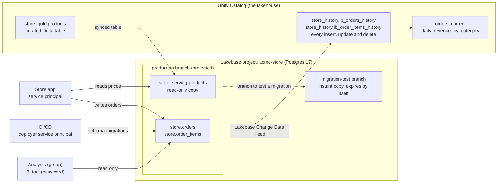
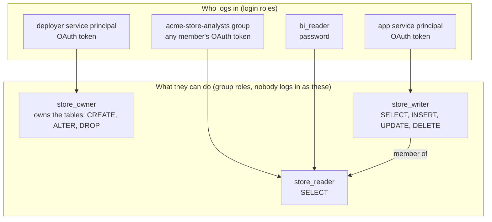

# Lakebase production starter

A small, complete example of running **Databricks Lakebase** (managed Postgres) the way you would in production: a protected production database, separate roles for people, applications and pipelines, schemas with sensible ownership, and data flowing **both ways** between Lakebase and Unity Catalog.

It is written for people who are new to Databricks. Every script explains what it does while it runs, and every step has a guide in [`docs/`](docs/) that explains the why.

> Everything in this repo was run end to end against a real Databricks workspace (AWS) in October 2026, with Databricks CLI v1.18.0 and databricks-sdk 0.147.0. Where the platform surprised us, the docs say so.

## What you'll build

An online store for a made-up company, Acme. The product catalog is curated in the lakehouse and served to the store app from Lakebase. The app writes orders to Lakebase, and every change to an order streams back into Unity Catalog for analytics.



Along the way you'll set up:

| Area | What the example does |
| --- | --- |
| **Project** | Postgres 17, protected production branch, autoscaling 1 to 4 CU with scale-to-zero off, 7-day restore window, cost tags |
| **Project permissions** | CI/CD gets CAN MANAGE. The app and the analysts get nothing: they only need Postgres roles |
| **Postgres roles** | Three group roles (`store_owner`, `store_writer`, `store_reader`) and four ways of logging in: a CI/CD service principal, an app service principal, a Databricks group, and a classic password role for a BI tool |
| **Schemas** | `store` for application tables (owned by a role, not a person) and `store_serving` for data synced from the lakehouse |
| **Unity Catalog to Lakebase** | A synced table keeps `store_serving.products` up to date from a Delta table |
| **Lakebase to Unity Catalog** | Lakebase Change Data Feed streams every change in `store` into Delta history tables, plus views that show current state |
| **Proving it** | A permission matrix where every identity logs in for real and tries the same six operations |
| **Day 2** | Rehearse a schema migration on a copy-on-write branch, recover a deleted order with point-in-time recovery, and (in the guide) scale, add HA and read replicas, monitor and rotate secrets |

## How the permissions fit together

Lakebase has two permission layers that never sync with each other, and Unity Catalog adds a third. Getting this straight is most of the work of running Lakebase in production, so [docs/04](docs/04-database-roles-schemas-and-grants.md) covers it in detail.



| Layer | Controls | Managed with | Example here |
| --- | --- | --- | --- |
| 1. Project permissions | Platform actions: branches, compute, settings | Databricks ACLs (CAN USE, CAN MANAGE) | The deployer can create test branches |
| 2. Postgres roles and grants | Who can log in to the database and touch which data | `CREATE ROLE`, `GRANT` | The app can insert orders but not drop tables |
| 3. Unity Catalog grants | Who can query the Delta tables in the lakehouse | `GRANT ... ON SCHEMA` | Analysts get read access to the order history in Delta (needs an account-level group) |

## Quick start

You need a Databricks workspace with Lakebase, Python 3.10 or newer, and the Databricks CLI. [docs/01](docs/01-before-you-start.md) walks through each of these.

```bash
git clone https://github.com/deepbasu123/lakebase-production-starter.git
cd lakebase-production-starter

python3 -m venv .venv && source .venv/bin/activate
pip install -r requirements.txt

databricks auth login --host https://<your-workspace-url> --profile my-workspace

cp config.toml config.local.toml     # then edit config.local.toml
python scripts/00_check_prerequisites.py
```

Then run the steps one at a time (recommended the first time, so you can read what each one prints), or all at once. If you're bringing your own service principals and group, run them one at a time and skip step 2 (see [Bring your own identities](docs/03-identities-and-project-permissions.md#bring-your-own-identities)):

```bash
./scripts/run_all.sh
```

## Prefer a notebook?

[`notebooks/lakebase_production_walkthrough`](notebooks/lakebase_production_walkthrough.py) runs the same steps inside your Databricks workspace, one cell at a time, with an explanation before each step and tables showing what it built (the synced products, the role memberships, the change history in Delta). To use it:

1. In your workspace, click **Workspace > Create > Git folder** and paste `https://github.com/deepbasu123/lakebase-production-starter`.
2. Open `notebooks/lakebase_production_walkthrough`, attach serverless compute, and fill in the **catalog** and **warehouse_id** widgets.
3. Run the cells in order. The last cell only shows the clean-up plan unless you switch its widget to *delete everything*.

Inside a notebook the scripts sign in as you, so no CLI profile is needed. Step 2 still needs workspace admin.

## The steps

| Step | Script | Guide | What happens |
| --- | --- | --- | --- |
| 0 | `00_check_prerequisites.py` | [01 Before you start](docs/01-before-you-start.md) | Checks your login, warehouse, catalog and project name |
| 1 | `01_create_project.py` | [02 Create a production project](docs/02-create-a-production-project.md) | Creates the Lakebase project with production settings |
| 2 | `02_create_demo_identities.py` | [03 Identities and project permissions](docs/03-identities-and-project-permissions.md) | Creates two service principals, a group and a secret scope (test workspaces only) |
| 3 | `03_grant_project_permissions.py` | [03 Identities and project permissions](docs/03-identities-and-project-permissions.md) | Layer 1: who can manage the project |
| 4 | `04_setup_database.py` | [04 Database roles, schemas and grants](docs/04-database-roles-schemas-and-grants.md) | Layer 2: group roles, login roles, the `store` schema and grants |
| 5 | `05_run_migrations.py` | [04 Database roles, schemas and grants](docs/04-database-roles-schemas-and-grants.md) | CI/CD creates the tables, as the deployer service principal |
| 6 | `06_sync_uc_to_lakebase.py` | [05 Sync Unity Catalog to Lakebase](docs/05-sync-unity-catalog-to-lakebase.md) | Synced table: Delta `products` to Postgres |
| 7 | `07_app_places_orders.py` | [06 Connect an application](docs/06-connect-an-application.md) | The app takes orders through a token-refreshing connection pool |
| 8 | `08_sync_lakebase_to_uc.py` | [07 Sync Lakebase to Unity Catalog](docs/07-sync-lakebase-to-unity-catalog.md) | Change data feed: Postgres orders to Delta history |
| 9 | `09_verify_roles.py` | [08 Prove the permissions](docs/08-prove-the-permissions.md) | Every identity logs in and tries six operations |
| 10 | `10_test_migration_on_branch.py` | [09 Day-2 operations](docs/09-day-2-operations.md) | Test a migration on a branch, then apply it to production |
| 11 | `11_verify_end_to_end.py` | [05](docs/05-sync-unity-catalog-to-lakebase.md), [07](docs/07-sync-lakebase-to-unity-catalog.md) | Round trip in both directions |
| 12 | `12_recover_deleted_data.py` | [09 Day-2 operations](docs/09-day-2-operations.md#get-deleted-data-back-point-in-time-recovery) | Delete an order by mistake, then get it back with point-in-time recovery |
| 99 | `99_teardown.py` | [09 Day-2 operations](docs/09-day-2-operations.md#clean-up) | Removes everything (dry run unless you pass `--yes`) |

The guides are numbered separately from the scripts; the table above maps one to the other. New to all of this? Start with [docs/00 Lakebase in plain English](docs/00-lakebase-in-plain-english.md). When something goes wrong, see [docs/10 Troubleshooting](docs/10-troubleshooting.md).

## Going further: infrastructure as code

The scripts are re-runnable and driven by one config file, which covers a lot of what infrastructure as code gives you. If your team manages Databricks with Declarative Automation Bundles, bundles can manage Lakebase projects, branches, computes, roles, databases, synced tables and catalog registrations (in Beta). Terraform has Lakebase resources too. See [Manage Lakebase with bundles](https://docs.databricks.com/aws/en/oltp/projects/manage-with-bundles) and [Automate with Terraform](https://docs.databricks.com/aws/en/oltp/projects/automate-with-terraform). The Postgres side (group roles, grants, default privileges) is still plain SQL, so keep `sql/` in your pipeline either way. This repo doesn't include a bundle because we haven't tested one end to end.

## What's in the repo

```text
config.toml                 every name and setting in one place (copy to config.local.toml)
requirements.txt            databricks-sdk and psycopg
docs/                       the guides, one per step
sql/
  01_roles_and_schema.sql   group roles, the store schema, default privileges (run by a platform admin)
  migrations/               schema migrations, run by CI/CD as store_owner
  proposed/                 a migration that isn't in production yet (used in step 10)
uc_sql/                     Databricks SQL for the lakehouse side (gold table, history views)
lakebase_starter/           small helpers: config, sign-in, connections, SQL on a warehouse, secrets
notebooks/                  the same steps as a guided Databricks notebook
scripts/                    the numbered steps
```

The SQL files are meant to be read. You can paste them into the Lakebase SQL editor and the Databricks SQL editor instead of running the scripts.

## Cost

While it exists, the production compute runs all the time (scale-to-zero is off, on purpose, at 1 to 4 CU). The synced table runs a small managed pipeline each time it syncs, and Lakebase Change Data Feed writes to Delta continuously. When you're done, run `python scripts/99_teardown.py` to see what will be removed, then add `--yes`.

## Status of the features used

As of October 2026:

| Feature | Status |
| --- | --- |
| Lakebase Postgres APIs (REST, CLI, SDKs) | Generally available since August 2026 |
| Synced tables (Unity Catalog to Lakebase) | Their APIs are part of the generally available Lakebase APIs. The optional LTAP Direct Writes speed-up is Beta |
| Lakebase Change Data Feed (Lakebase to Unity Catalog) | Public Preview. A workspace admin enables it on the Previews page. Its CLI commands are marked Beta |
| Declarative Automation Bundles for Lakebase | Beta |

Check the [Lakebase release notes](https://docs.databricks.com/aws/en/release-notes/lakebase/) for anything newer.

## License

MIT. This is an example, not a supported product. Read the code and adapt it before you use it for anything real.
