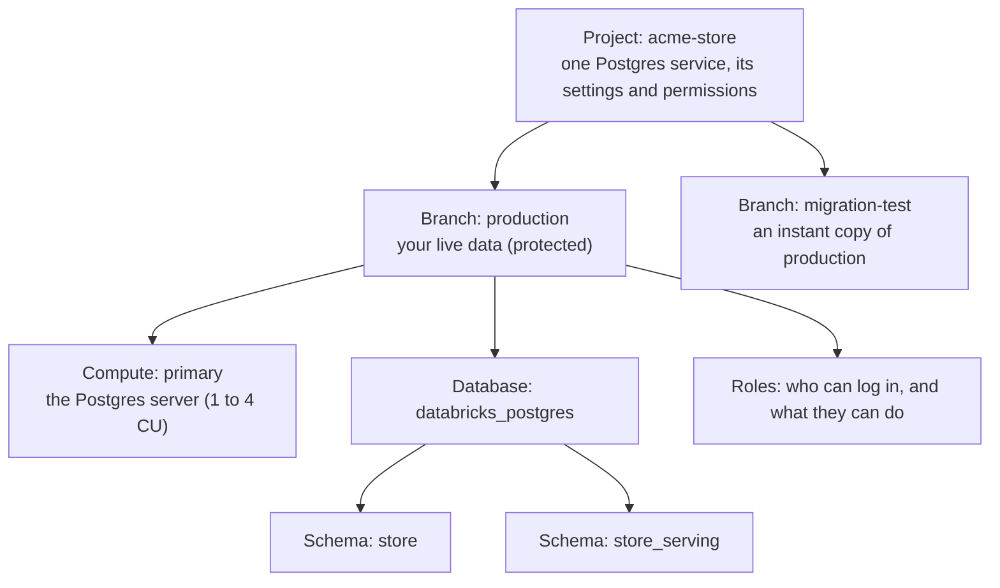

# 00. Lakebase in plain English

Read this first if Databricks, Lakebase or Postgres is new to you. It explains the handful of ideas the rest of the example relies on. No code.

## Two kinds of database, one platform

Most companies end up with two kinds of data system, because they do two very different jobs.

| | Operational database (Lakebase) | Analytical platform (the lakehouse) |
| --- | --- | --- |
| Also called | OLTP: online transaction processing | OLAP: online analytical processing |
| Built for | Lots of small reads and writes, fast | Big scans over lots of history |
| A typical query | "Fetch order 1234", "save this new order" | "Revenue by category per day for the last year" |
| Who uses it | Applications, websites, APIs | Analysts, dashboards, data science, ML |
| In Databricks | Lakebase (managed Postgres) | Delta tables in Unity Catalog, queried with SQL warehouses or Spark |

Lakebase is a fully managed **Postgres** database that runs inside Databricks. Postgres is one of the most widely used open source databases, so most tools that speak Postgres (drivers, ORMs, psql, DBeaver, pgAdmin) work with it. Two differences to know: connections must use TLS, and OAuth logins use a one-hour token instead of a fixed password.

The point of having both inside one platform is that they can share data without you building and running your own pipelines:

* **Unity Catalog to Lakebase.** Curated data from the lakehouse (a product catalog, customer scores, ML features) is copied into Postgres, so an app can look it up in milliseconds. These copies are called **synced tables**.
* **Lakebase to Unity Catalog.** Every change an app makes in Postgres (new orders, status updates) is streamed into Delta tables, so analysts can query it alongside everything else. This is **Lakebase Change Data Feed (CDF)**. It launched in Beta as "Lakehouse sync" and was renamed when it reached Public Preview.

## The building blocks

**Project.** The top-level container. One project is one Postgres service, with its own settings, permissions and billing tags. This example creates one project, `acme-store`.

**Branch.** A complete, independent copy of the database: data, schemas, roles and grants. Every project starts with a `production` branch. Creating another branch takes seconds and stores nothing extra until you change data in it ("copy-on-write"). Branches are how you test a change against real data without touching production. Each branch can be given an expiry time, so test branches clean themselves up.

**Compute** (called an *endpoint* in the API). The Postgres server that runs queries for a branch. Its size is measured in **Compute Units (CU)**, about 2 GB of memory each. A compute can **autoscale** between a minimum and a maximum, and can **scale to zero** (shut down) when idle and wake up on the next connection. For production you usually turn scale-to-zero off, so no request ever waits for a wake-up.

**Database.** A normal Postgres database inside a branch. Every project gets one called `databricks_postgres`. This example keeps everything in it.

**Schema.** A folder for tables inside a database. This example uses two:

* `store`: the app's own tables (`orders`, `order_items`). The app reads and writes them.
* `store_serving`: read-only tables synced from Unity Catalog (`products`).

**Role.** Postgres' word for both "user" and "group". A role that can log in acts like a user; a role that can't log in is a bundle of permissions that other roles can be members of.

## Identities: who is logging in

Databricks has three kinds of identity, and all three can be given a Postgres role:

| Identity | What it is | How it logs in to Lakebase | Example here |
| --- | --- | --- | --- |
| User | A person with a Databricks login | Their own OAuth token | You, the project owner |
| Service principal | A non-human identity for apps and automation | An OAuth token it gets with its client ID and secret | `acme-store-app`, `acme-store-deployer` |
| Group | A set of users and service principals | Any member logs in with their own token, using the group's role name | `acme-store-analysts` |

**OAuth tokens** are short-lived passwords (one hour) that Databricks hands out to an identity on request. Nobody has to store a database password, and once someone is removed from Databricks (or from the group they log in through) they can't get a new token, so they can't open new connections. Connections that are already open stay open until they close.

Lakebase also supports classic **Postgres passwords** for tools that can't fetch OAuth tokens. They are switched off by default on new projects and have no link to a Databricks identity, so use them sparingly.

## Three permission layers

This trips up almost everyone at first, so here it is up front. There are three separate sets of permissions, and none of them updates the others:

1. **Project permissions** (Databricks ACLs: CAN USE, CAN MANAGE). Who can manage the *infrastructure*: create branches, resize compute, change settings.
2. **Postgres roles and grants.** Who can *log in to the database* and what they can do with the *data* in it.
3. **Unity Catalog grants.** Who can query *Delta tables* in the lakehouse, including the history tables Lakebase Change Data Feed writes.

An analyst might need all three, an application usually needs only layer 2, and a platform engineer might need only layer 1. [03](03-identities-and-project-permissions.md) and [04](04-database-roles-schemas-and-grants.md) go through each.

## Glossary

| Term | Meaning |
| --- | --- |
| CDF | Lakebase Change Data Feed: streams Postgres changes into Delta history tables. Not to be confused with Delta's own change data feed, which synced tables read on the Unity Catalog side |
| CU | Compute Unit, about 2 GB of memory. Compute size and cost are measured in CU |
| Copy-on-write | A branch shares storage with its parent and only stores what changes |
| Default privileges | Postgres rules that grant permissions on tables that will be created in the future |
| Delta | The open table format used by tables in the lakehouse |
| Gold table | A cleaned, curated table ready for use. Comes from the "medallion" naming (bronze raw, silver cleaned, gold curated) |
| Group role | A Postgres role that can't log in and only exists to hold permissions (`store_reader` here) |
| Login role | A Postgres role someone or something logs in as (an email, a service principal's ID, a group name, or a password role) |
| Migration | A script that changes the database structure, such as creating a table or adding a column |
| OAuth | The token-based sign-in Databricks uses. Database tokens last one hour |
| Protected branch | A branch that can't be deleted or reset. Use it for production |
| REPLICA IDENTITY FULL | A Postgres table setting that records the full old row on every update and delete. CDF needs it |
| Scale to zero | The compute shuts down when idle and starts again on the next connection |
| Service principal | A Databricks identity for software, not people |
| Synced table | A read-only copy of a Unity Catalog table kept up to date in Postgres |
| Unity Catalog | Databricks' catalog and permission system for data and AI assets |

## Official docs

* [Lakebase Postgres overview](https://docs.databricks.com/aws/en/oltp/projects/)
* [Core concepts](https://docs.databricks.com/aws/en/oltp/projects/core-concepts)
* [Branches](https://docs.databricks.com/aws/en/oltp/projects/branches)
* [Roles and permissions](https://docs.databricks.com/aws/en/oltp/projects/roles-permissions)

Links in this repo point at the AWS edition of the docs. Azure has the same pages; switch the cloud selector on the docs site.

Next: [01. Before you start](01-before-you-start.md)
