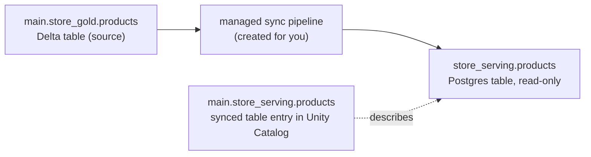

# 05. Sync Unity Catalog to Lakebase (synced tables)

**Script:** `scripts/06_sync_uc_to_lakebase.py` (and round trip 1 of `scripts/11_verify_end_to_end.py`)
**SQL:** `uc_sql/01_gold_products.sql`

## The problem it solves

The product catalog is built in the lakehouse: prices, stock levels and ratings are worked out by pipelines over lots of raw data. The store app needs that catalog too, but it needs to fetch single products in milliseconds, thousands of times a second. That's a job for Postgres, not for a SQL warehouse.

A **synced table** is a read-only copy of a Unity Catalog table, kept in Lakebase and refreshed by a managed pipeline. You don't write or schedule the copy job yourself.



## Run it

```bash
python scripts/06_sync_uc_to_lakebase.py
```

```text
==> Synced table main.store_serving.products
    [ok] created
==> Waiting for the first sync to finish (usually a few minutes)
    state: SYNCED_TABLE_PROVISIONING_PIPELINE_RESOURCES
    state: SYNCED_TABLE_PROVISIONING_INITIAL_SNAPSHOT
    state: SYNCED_TABLE_ONLINE_TRIGGERED_UPDATE
    state: SYNCED_TABLE_ONLINE_NO_PENDING_UPDATE
    [ok] online
==> A peek at the data, straight from Postgres
    1001  Ridgeline 2P Ultralight Tent           549.00  stock 42
    ...
    (Postgres table owner: databricks_writer_16406, an internal role that keeps the table in sync)
```

In our test the first sync finished in a few minutes.

## What the script does

**1. Creates the source table** (`uc_sql/01_gold_products.sql`) with Delta's change data feed switched on:

```sql
CREATE TABLE IF NOT EXISTS main.store_gold.products ( ... )
TBLPROPERTIES (delta.enableChangeDataFeed = true);
```

Triggered and Continuous synced tables need a change data feed on the source to find changed rows: Delta's change data feed (as here) or the *automatic change data feed* option the docs describe for other sources such as Iceberg tables. If it's missing, the UI warns you and shows the `ALTER TABLE` command. Snapshot mode doesn't need it.

**2. Creates the synced table:**

```python
w.postgres.create_synced_table(
    synced_table_id="main.store_serving.products",          # where it appears in Unity Catalog
    synced_table=SyncedTable(spec=SyncedTableSyncedTableSpec(
        source_table_full_name="main.store_gold.products",
        primary_key_columns=["product_id"],
        scheduling_policy=SchedulingPolicy.TRIGGERED,
        branch="projects/acme-store/branches/production",
        postgres_database="databricks_postgres",
        create_database_objects_if_missing=True,             # create the Postgres schema if needed
        new_pipeline_spec=NewPipelineSpec(                   # where the pipeline keeps its bookkeeping
            storage_catalog="main", storage_schema="store_serving"),
    )),
).wait()
```

**The naming rule that shapes everything:** the synced table's Unity Catalog *schema* name becomes the *Postgres schema* name, and its table name becomes the Postgres table name. `main.store_serving.products` lands in Postgres as `store_serving.products`. That's why the example uses distinctive schema names: a generic name like `serving` would collide in a shared catalog. Names may only contain letters, digits and underscores.

**3. Waits for the first sync,** polling `get_synced_table()` until the table reports `SYNCED_TABLE_ONLINE_NO_PENDING_UPDATE` (online, nothing left to copy). It stops early, with the pipeline's message, if the table goes offline or the pipeline fails.

**4. Grants access in Postgres:**

```sql
GRANT USAGE ON SCHEMA store_serving TO store_reader;
GRANT SELECT ON ALL TABLES IN SCHEMA store_serving TO store_reader;
```

Synced tables are owned by an internal role (`databricks_writer_<id>`), not by `store_owner`, so the default privileges from [04](04-database-roles-schemas-and-grants.md) don't apply to them. Re-run this grant whenever you add another synced table to the schema. The identity that created the synced table gets some privileges on it automatically; everyone else needs a grant like the one above.

## Choosing a sync mode

| Mode | What a sync does | Needs a change data feed on the source | Good for |
| --- | --- | --- | --- |
| SNAPSHOT | Copies the whole table every time | No | Small tables, or when more than about 10% of rows change between syncs |
| TRIGGERED | Copies only rows that changed since the last sync, when you trigger it | Yes | Most apps: refresh hourly or when the source changes |
| CONTINUOUS | Streams changes within seconds, all the time | Yes | Data that must be fresh within seconds. Costs the most |

This example uses **TRIGGERED**. Rough throughput per CU of Lakebase compute, from the docs: about 2,000 rows a second for Snapshot and about 150 rows a second for Triggered and Continuous.

## Keeping it fresh

A TRIGGERED synced table only syncs when something triggers it. The documented options:

* **The UI:** open the synced table in Catalog Explorer and click **Sync now**.
* **A Lakeflow job:** add a *Database Table Sync pipeline* task for the synced table's pipeline, with either a *table update* trigger on the source table (sync whenever the gold table changes) or a schedule.

`scripts/11_verify_end_to_end.py` does it from code, by starting the synced table's pipeline with the Pipelines API. This is what we ran, and it worked:

```python
pipeline_id = w.postgres.get_synced_table(
    name="synced_tables/main.store_serving.products").status.pipeline_id
w.pipelines.start_update(pipeline_id=pipeline_id)
```

Round trip 1 of that script changes a price in `main.store_gold.products`, triggers the sync, and checks that Postgres has the new price.

## Rules to know before you rely on it

* **The Postgres copy is read-only.** Apps may `SELECT`, and you may add indexes, but don't `INSERT`, `UPDATE` or `DELETE` in it. The next sync would undo it, and the docs warn it can break the sync. Our permission test shows the app role can't update it anyway.
* **Primary key.** You must name one. Rows with a null key are skipped, and duplicate keys fail the sync unless you set a `timeseries_key` (then the latest row per key wins).
* **Schema changes.** Triggered and Continuous tables accept additive changes such as new columns. Anything else (renaming, changing a type, changing the key) means deleting and recreating the synced table.
* **Types.** Most types map directly (`STRING` to `TEXT`, `DECIMAL` to `NUMERIC`, `TIMESTAMP` to `TIMESTAMP WITH TIME ZONE`, and `ARRAY`, `MAP` and `STRUCT` to `JSONB`). `GEOGRAPHY`, `GEOMETRY`, `VARIANT` and `OBJECT` aren't supported. Null bytes inside strings break the sync; clean them in the source.
* **Decide what the app may see before you sync.** In Postgres, the copy is governed by Postgres permissions. The docs don't describe Unity Catalog row filters or column masks carrying over to it, so don't rely on them: sync only the rows and columns the app needs (a view can be the source; check which sync modes your source supports).
* **Capacity.** Each synced table uses up to 16 connections to your compute, and synced data counts towards the branch's storage. A full refresh keeps the old copy until the new one is ready, so both count for a while.
* **Cost.** Each sync runs a managed pipeline. Several synced tables can share one pipeline (`existing_pipeline_id` instead of `new_pipeline_spec`), which is worth considering when you sync many tables.

## Deleting a synced table

```python
w.postgres.delete_synced_table(name="synced_tables/main.store_serving.products").wait()
```

This removes the Unity Catalog entry and stops the pipeline. The docs aren't consistent about whether the Postgres table is dropped too, so if you're keeping the project, check and drop it yourself: `DROP TABLE IF EXISTS store_serving.products;`

## Official docs

* [Serve lakehouse data with synced tables](https://docs.databricks.com/aws/en/oltp/projects/sync-tables)
* [Quickstart: synced tables](https://docs.databricks.com/aws/en/oltp/projects/quickstart-synced-tables)

Next: [06. Connect an application](06-connect-an-application.md)
