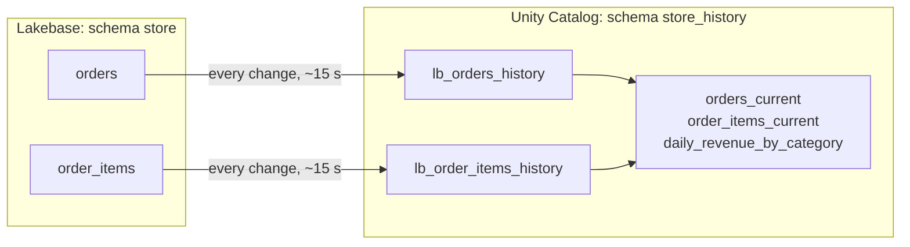

# 07. Sync Lakebase to Unity Catalog (Lakebase Change Data Feed)

**Script:** `scripts/08_sync_lakebase_to_uc.py` (and round trip 2 of `scripts/11_verify_end_to_end.py`)
**SQL:** `uc_sql/02_history_views.sql`

## The problem it solves

Orders are written by the app into Postgres. The people who want to analyse them work in the lakehouse: dashboards, Genie, notebooks, ML. Copying the data across used to mean running your own change-data-capture stack.

**Lakebase Change Data Feed (CDF)** does it for you. It reads Postgres' write-ahead log (the record Postgres keeps of every change) and writes each insert, update and delete as a new row in a Unity Catalog Delta table, in batches roughly every 15 seconds. There's no pipeline or job for you to run.



The feature launched in Beta in March 2026 as "Lakehouse sync". It was renamed Lakebase Change Data Feed when it reached Public Preview in May 2026. In CLI v1.18 its commands (`create-cdf-config` and friends) are still marked Beta.

## Before you start

* **A workspace admin must enable it.** It's a preview: open the workspace **Previews** page and switch on Lakebase Change Data Feed.
* **Postgres 16, 17 or 18.** One feed reads from one database, and it doesn't have to be `databricks_postgres`.
* **Every table needs `REPLICA IDENTITY FULL`.** Migration 001 sets it. Check with the query below.
* **Every table needs at least one row.** Empty tables are skipped until they get data. That's why the example runs the app (step 7) before this step.
* **No partitioned tables.**
* **The destination catalog must not use default storage**, or managed storage you can only reach through a private endpoint.
* **Permissions:** CAN MANAGE on the Lakebase project, plus `USE CATALOG`, `USE SCHEMA` and `CREATE TABLE` on the destination in Unity Catalog.

```sql
-- Which tables in `store` are ready? Only 'full' can be streamed.
SELECT c.relname,
       CASE c.relreplident WHEN 'f' THEN 'full' WHEN 'd' THEN 'default'
                           WHEN 'n' THEN 'nothing' WHEN 'i' THEN 'index' END AS replica_identity
FROM pg_class c JOIN pg_namespace n ON n.oid = c.relnamespace
WHERE n.nspname = 'store' AND c.relkind = 'r';
```

## Run it

```bash
python scripts/08_sync_lakebase_to_uc.py
```

```text
==> Checking the Postgres tables are ready for CDF
    [ok] store.order_items: REPLICA IDENTITY FULL, 11 rows
    [ok] store.orders: REPLICA IDENTITY FULL, 5 rows
==> Starting the change data feed for Postgres schema `store`
    [ok] created projects/acme-store/branches/production/databases/databricks-postgres/cdf-configs/store_to_unity_catalog
==> Waiting for each table to finish its first snapshot and start streaming
    order_items=CDF_STATE_STREAMING, orders=CDF_STATE_STREAMING
    [ok] all tables are streaming
```

In our test both tables were streaming within seconds of the feed starting.

## What the script does

**It works per schema.** A feed covers one Postgres schema, and every current *and future* table in it. That's the reason synced tables live in a separate schema (`store_serving`): you don't want the feed picking up copies of lakehouse data and sending them back.

**Finding the database's resource path.** The API wants the database's *resource path*, which isn't the same as its Postgres name. The Postgres database `databricks_postgres` has the resource ID `databricks-postgres` (hyphen, not underscore):

```python
database = next(
    d.name for d in w.postgres.list_databases(parent="projects/acme-store/branches/production")
    if d.status.postgres_database == "databricks_postgres"
)   # projects/acme-store/branches/production/databases/databricks-postgres
```

**Creating the feed:**

```python
cdf_config = w.postgres.create_cdf_config(
    parent=database,
    cdf_config_id="store_to_unity_catalog",      # underscores: this ID must match [a-z][a-z0-9_]*
    cdf_config=CdfConfig(catalog="main", schema="store_history", postgres_schema="store"),
).wait()
```

**Watching it:** per-table statuses live under the feed, not under the database:

```python
for status in w.postgres.list_cdf_statuses(parent=cdf_config.name):
    print(status.postgres_table, status.state, status.uc_table)   # CDF_STATE_SNAPSHOTTING, then CDF_STATE_STREAMING
```

From Postgres you can also run `SELECT * FROM wal2delta.tables;`. In the UI, open Lakebase Postgres from the app switcher, pick the project and branch, click the branch name in the breadcrumb to open **Branch overview**, then the **Lakebase CDF** tab.

## What lands in Unity Catalog

One Delta table per Postgres table, named `lb_<table>_history`, with your columns plus five more:

| Column | Meaning |
| --- | --- |
| `_pg_change_type` | `insert`, `update_preimage` (the row before an update), `update_postimage` (the row after), or `delete` |
| `_pg_lsn` | Postgres log sequence number |
| `_pg_xid` | Postgres transaction ID |
| `_timestamp` | When the change was processed (no time zone) |
| `_sort_by` | A sort key that puts all changes in order |

Here's what we saw in our test:

* **Rows that existed when the feed started arrive as `insert`s, and that's all.** Our 5 orders had already moved on to paid, shipped or cancelled before step 8 ran, and `lb_orders_history` held 5 `insert` rows and no updates. History starts when the feed starts.
* **After that, everything streams.** In step 11 the app placed an order and marked it paid. Within seconds the history table had an `insert`, an `update_preimage` and an `update_postimage` for it.
* **Writes on other branches stay out.** In step 10 the app wrote a test order on the `migration-test` branch. A minute later there was no trace of it in Unity Catalog. The feed follows the branch it was created on.

**Types** convert sensibly: `TEXT` to `STRING`, `NUMERIC(p,s)` to `DECIMAL` (or `STRING` if the precision is unbounded or above 38), `TIMESTAMPTZ` to `TIMESTAMP`, `TIMESTAMP` to `TIMESTAMP_NTZ`, `JSONB` and enums to `STRING`. Check the table in the docs before using unusual types.

## Current-state views

The history is perfect for audit and incremental pipelines, but most questions want "what does each order look like now?". `uc_sql/02_history_views.sql` creates views that keep the latest version of each row and drop deleted ones:

```sql
CREATE OR REPLACE VIEW main.store_history.orders_current AS
SELECT * EXCEPT (rn, _pg_change_type, _pg_lsn, _pg_xid, _timestamp, _sort_by)
FROM (
  SELECT *, ROW_NUMBER() OVER (PARTITION BY order_id ORDER BY _sort_by DESC) AS rn
  FROM main.store_history.lb_orders_history
  WHERE _pg_change_type IN ('insert', 'update_postimage', 'delete')
)
WHERE rn = 1 AND _pg_change_type <> 'delete';
```

and one that joins app data with lakehouse data, which is the reason to sync both ways:

```sql
SELECT order_date, category, orders, revenue
FROM main.store_history.daily_revenue_by_category
ORDER BY order_date DESC, revenue DESC;
```

These are plain views, recomputed on every query. For large tables, build the same logic as a materialized view or a Lakeflow pipeline that reads the history incrementally. The CDF docs have examples of both.

## Schema changes rewrite the history table

This one matters if you're counting on the history for audit. When a migration **adds or drops a column** (or changes a type) on a streamed table, CDF *re-snapshots* that table. We watched it happen in step 10, which adds `delivery_note` to `store.orders`:

```text
DESCRIBE HISTORY main.store_history.lb_orders_history     (abridged, from our test)

version 2   wal2delta.resnapshot    <- after ALTER TABLE ... ADD COLUMN
version 1   wal2delta.resnapshot    <- the first snapshot when the feed started
version 0   CREATE TABLE
```

After the re-snapshot, the current version of `lb_orders_history` held one fresh `insert` per existing order, with the new column, and **none of the earlier change rows**. They're still readable with Delta time travel, for example `SELECT * FROM main.store_history.lb_orders_history VERSION AS OF 1`, until old versions are vacuumed.

If you need a permanent audit trail across schema changes, copy the changes into a table you own before changing the schema (for example with a Lakeflow pipeline that streams from the history table), and keep migrations that touch streamed tables rare and planned.

## Unity Catalog permissions: the third layer

Being `store_reader` in Postgres gives no access to the Delta history tables, and Unity Catalog grants give no access to Postgres. The script grants the analysts group read access in Unity Catalog:

```sql
GRANT USE CATALOG ON CATALOG main TO `acme-store-analysts`;
GRANT USE SCHEMA, SELECT ON SCHEMA main.store_history TO `acme-store-analysts`;
```

In our test workspace this grant failed with `PRINCIPAL_DOES_NOT_EXIST`, because the group step 2 created was a workspace-local group, which Unity Catalog doesn't recognise. The script detects that and explains it instead of failing. Unity Catalog grants need an account-level group, which is what you'd normally use in production. We couldn't create one in the test workspace, so this grant is the one part of the flow we didn't see succeed.

Two warnings from the docs about the destination tables: **don't add row filters or column masks to them** (CDF stops writing), and **don't turn on Delta's change data feed on them** (it breaks re-snapshots). If analysts must not see some columns, give them a view instead.

## Living with the feed

* **New tables are picked up automatically.** Create the table in `store` with `REPLICA IDENTITY FULL`, and it starts streaming once it has a row. Don't start the feed again from the UI: a schema can only have one feed.
* **Dropping a Postgres table keeps its Delta history table.**
* **Stopping the feed.** `w.postgres.delete_cdf_config(name=...)` removes the feed configuration and keeps the Delta tables. Disabling CDF from the UI stops the feed for *every* schema in the project. The docs don't say what happens to changes made while a feed is stopped, so treat a stop as a gap in the history and plan restarts carefully.

## Official docs

* [Lakebase Change Data Feed](https://docs.databricks.com/aws/en/oltp/projects/lakebase-cdf)
* [Quickstart: Lakebase CDF](https://docs.databricks.com/aws/en/oltp/projects/quickstart-lakebase-cdf)
* [Lakebase release notes](https://docs.databricks.com/aws/en/release-notes/lakebase/)

Next: [08. Prove the permissions](08-prove-the-permissions.md)
